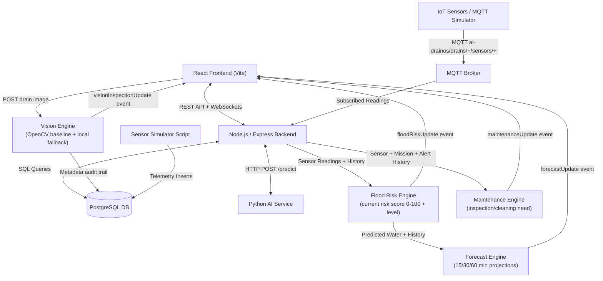
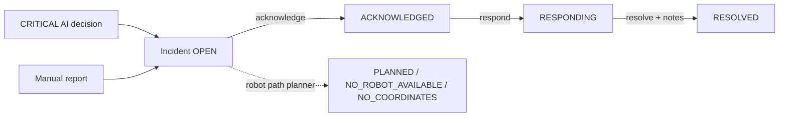
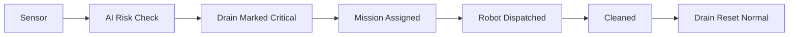

# 🚧 AI-DrainOS: Autonomous Municipal Drainage Monitoring & Robot Dispatch System

[](LICENSE)
[](https://nodejs.org)
[](https://www.postgresql.org)
[](https://www.python.org)
[](https://www.docker.com)

**AI-DrainOS** is an intelligent, full-stack municipal drainage management platform designed to monitor urban drainage networks in real time, predict flood risks using machine learning, automate autonomous cleaning robot dispatches, manage battery charging lifecycles, and enforce strict Role-Based Access Control (RBAC).

---

## Table of Contents

1. [Project Title](#1-project-title)
2. [Project Overview](#2-project-overview)
3. [Problem Statement](#3-problem-statement)
4. [Objectives](#4-objectives)
5. [Key Features](#5-key-features)
6. [System Architecture](#6-system-architecture)
7. [Frontend Architecture](#7-frontend-architecture)
8. [Backend Architecture](#8-backend-architecture)
9. [Python AI Service Architecture](#9-python-ai-service-architecture)
10. [PostgreSQL Database](#10-postgresql-database)
11. [Socket.IO Real-time Communication](#11-socketio-real-time-communication)
12. [Robot Mission Engine](#12-robot-mission-engine)
13. [Robot Charging System](#13-robot-charging-system)
14. [Sensor Simulator](#14-sensor-simulator)
15. [AI Flood Prediction](#15-ai-flood-prediction)
16. [Manual Mission Control](#16-manual-mission-control)
17. [Notification System](#17-notification-system)
18. [Settings Management](#18-settings-management)
19. [Authentication and RBAC](#19-authentication-and-rbac)
20. [API Endpoint List](#20-api-endpoint-list)
21. [Database Tables](#21-database-tables)
22. [Important Socket.IO Events](#22-important-socketio-events)
23. [Environment Variables](#23-environment-variables)
24. [Installation Instructions](#24-installation-instructions)
25. [Development Setup](#25-development-setup)
26. [How to Start PostgreSQL](#26-how-to-start-postgresql)
27. [How to Start Backend](#27-how-to-start-backend)
28. [How to Start Frontend](#28-how-to-start-frontend)
29. [How to Start Python AI Service](#29-how-to-start-python-ai-service)
30. [How to Start Sensor Simulator](#30-how-to-start-sensor-simulator)
31. [Testing Instructions](#31-testing-instructions)
32. [Project Folder Structure](#32-project-folder-structure)
33. [System Workflow](#33-system-workflow)
34. [Robot Lifecycle](#34-robot-lifecycle)
35. [Critical Drain Workflow](#35-critical-drain-workflow)
36. [Sensor → AI → Alert Workflow](#36-sensor--ai--alert-workflow)
37. [Mission → Robot → Cleaning → Charging Workflow](#37-mission--robot--cleaning--charging-workflow)
38. [Screenshots Section](#38-screenshots-section)
39. [Known Limitations](#39-known-limitations)
40. [Future Enhancements](#40-future-enhancements)

---

## 1. Project Title
**AI-DrainOS — Smart Municipal Drainage Monitoring & Autonomous Robot Dispatch Platform**

## 2. Project Overview
AI-DrainOS unifies IoT telemetry, machine learning flood predictions, GIS mapping, real-time WebSockets, and automated robotic cleaning into a single command center.

## 3. Problem Statement
Urban flash flooding caused by blocked storm drains poses significant risks to infrastructure and safety. Manual drain inspection is reactive, dangerous, and inefficient. AI-DrainOS solves this through real-time telemetry, predictive AI, and autonomous robot dispatches.

## 4. Objectives
- Provide real-time visibility into municipal drainage health.
- Automate flood risk predictions using machine learning.
- Dispatch autonomous robots to critical drains before flash floods occur.
- Manage robot battery lifecycles and automated charging.
- Deliver granular Role-Based Access Control (Admin / Operator).

## 5. Key Features
- **Real-Time GIS Drain Map**: Interactive Leaflet map with animated robot markers (`react-leaflet-drift-marker`).
- **Autonomous Robot Dispatch**: Automatic nearest-robot assignment for drains flagged Critical.
- **AI Risk Engine**: Python machine learning service evaluating water level, gas, and temperature telemetry.
- **Battery Management & Charging**: Autonomous routing to designated charging stations when battery drops below low threshold (20%).
- **User Management & RBAC**: Admin management of system users, role privileges, and account activation/deactivation.
- **Real-time Notifications**: Instant Socket.IO notifications for critical alerts, low battery warnings, and completed cleanings.
- **MQTT IoT Sensor Integration**: Consumes live readings from MQTT-capable IoT drain sensors (or the bundled `simulate:mqtt` simulator), validates them, persists to PostgreSQL, runs AI prediction, and streams live `sensorUpdate` events.
- **Flood Risk Intelligence & Early Warning**: An explainable, deterministic Flood Risk Score (0–100) + risk level (LOW/MODERATE/HIGH/CRITICAL) computed from water/gas/temperature plus a rising-water trend component, combined with the AI prediction and broadcast live via `floodRiskUpdate`.
- **Predictive Flood Forecasting & 15/30/60-Minute Early Warning**: An "Explainable Baseline Forecast" that fits a time-aware water-level trend and projects each drain's future risk at 15 / 30 / 60 minutes (reusing the flood risk engine), streamed live via `forecastUpdate`, with dedicated `Flood Forecast` early-warning alerts and an honest "insufficient history" status (no fabricated confidence).
- **Drain Maintenance & Blockage Prediction**: A third independent analytical layer that looks at long-term operational patterns (cleaning history, rising trends, gas/temperature anomalies, alert frequency) to predict whether a drain needs inspection or cleaning soon. Honest baseline — never claims physical blockage, never reports confidence. Live `maintenanceUpdate` events, `Maintenance` alert type, audit trail in `maintenance_predictions` table, and a dashboard panel.
- **Drain Vision Inspection**: Baseline **computer-vision** drain inspection driven by OpenCV (Python AI service) with an honest local PNG fallback. Upload a drain image (JPG/JPEG/PNG/WEBP, ≤5 MB), get visual risk / possible-blockage scores, findings and a recommendation — with an `INSUFFICIENT_IMAGE_QUALITY` status when an image cannot be analyzed (never fabricates results). Results stay **separate** from the sensor maintenance engine and are stored as metadata-only rows in the `drain_vision_inspections` table. Robot dispatch is only ever a recommendation flag — `missionEngine.js` remains the authority. Live `visionInspectionUpdate` events + `Vision Inspection` alert type (+ dashboard panel + analytics section).
- **AI Drain Decision & Priority Engine**: An explainable attention-priority layer that blends the existing Flood Risk, Forecast, Maintenance and Vision scores (weights in `decisionEngine.js`) into a single bounded 0–100 priority with a recommended action (monitor → close watch → inspect → immediate robot inspection), human-readable reasons, weighted contributing factors, and a robot dispatch recommendation (nearest / already-assigned / battery-too-low / none). Missing signals are reported as unavailable — `INSUFFICIENT_DATA` with a null score when nothing is known. Live `decisionUpdate` events (level change or ≥3-point move), dashboard panel + dedicated "AI Decisions" page, and an analytics section. Read-only: it never writes to the database and never triggers dispatches itself.
- **Intelligent Robot Path Planning & Route Optimization**: An explainable, battery-aware planning layer for high/critical drains. It selects the best available robot (never Charging or on an active mission) using a deterministic score over distance, battery and battery sufficiency, then plans a coordinate-space route — `START → TARGET` (direct) or `START → CHARGING_STATION → TARGET` when the direct route is not feasible — with cumulative distance, time and battery estimates and an honest `NO_ROBOT_AVAILABLE` state. Live `robotRouteUpdate` events, a `RobotRoutePlanner` dashboard panel, and route polylines on the drain map. Reuses the existing movement-loop constants; `missionEngine.js` and the robot movement loop are untouched.
- **Interactive 3D Digital Twin**: An additive, read-only 3D visualization layer (`three.js` + `@react-three/fiber` + `@react-three/drei`) rendered as a new **Digital Twin** page plus a compact live preview on the Dashboard. It aggregates the **existing** REST APIs and consumes the **existing** single Socket.IO connection to show drains, sensors, robots, charging stations and planner routes — with real flood-risk rings, separate AI-decision bars, live sensor water levels, click-to-inspect details (lazy per-drain risk/forecast/maintenance/decision/vision calls) and a non-3D data list fallback. It never writes to the database and never adds a second socket connection or movement loop. Coordinates use a documented visualization grid (not survey-grade GIS). See [docs/digital-twin.md](docs/digital-twin.md).
- **Autonomous Emergency Response & Incident Intelligence**: A real, auditable incident lifecycle (`OPEN → ACKNOWLEDGED → RESPONDING → RESOLVED`) for high-stakes events. Incidents are created from **real** CRITICAL AI decisions (fire-and-forget hook in the MQTT pipeline), from other real engines, or manually; a CRITICAL incident automatically reuses the **existing** robot path planner (never a duplicate planner) and honestly records `PLANNED`, `MANUAL`, `NO_ROBOT_AVAILABLE` or `NO_COORDINATES`. One active incident per drain (partial unique index), guarded transitions, a timeline built **only** from stored timestamps, dashboard/analytics overlays, live `incidentUpdate` events, an Emergency Response panel, a dedicated Incidents page, and an additive Digital Twin beacon. See [docs/incidents.md](docs/incidents.md).
- **Predictive Resource & Robot Fleet Optimization**: An **advisory** fleet-level layer (`server/services/fleetOptimizationService.js`) that reads the real robots/drains/incidents/decisions and produces explainable robot-to-task recommendations ranked by a documented priority score (decision 0.60 · severity 0.20 · age 0.10 · urgency 0.10) and candidate score (distance 35 · battery 25 · ETA 20 · availability 10 · feasibility 10), with honest availability states (`AVAILABLE`/`BUSY`/`CHARGING`/`LOW_BATTERY`/`OFFLINE`/`UNAVAILABLE`) and battery-aware route modes (`DIRECT`/`CHARGE_THEN_TASK`/`NO_FEASIBLE_ROUTE`). It **never** assigns or moves robots — `missionEngine.js` stays the authority — and reuses the existing decision engine + path planner rather than duplicating them. Read-only REST (`/api/fleet-optimization`), additive dashboard/analytics fields, a signature-guarded live `fleetOptimizationUpdate` event, a Fleet Optimization panel/page, and an additive Digital Twin overlay. See [docs/fleet-optimization.md](docs/fleet-optimization.md).
- **Historical Intelligence & Continuous Learning Foundation**: An **evidence/analytics** layer (`server/services/historicalIntelligenceService.js`) that answers *what the recorded history actually shows* over a bounded window (24h/7d/30d/90d, default 30d) — reading counts, averages, min/max, first/last and real-trend labels per sensor; incident/mission/alert aggregates with real response/resolution timings; descriptive time-of-day patterns; current-vs-historical comparison (live `sensors` vs window average, and a like-for-like vs the immediately preceding window); and a descriptive historical drain-health **label** derived from real evidence thresholds (not the AI Decision score). It is strictly **read-only**, adds **no new tables**, reuses existing records only, and never fabricates: a metric with no samples is `null`, a period with no records is `INSUFFICIENT_DATA`, and missing signals are reported in `data_quality.missing_signals`. Additive surfaces: read-only `/api/historical` (full + focused views), additive dashboard `historicalSummary` and analytics `historical_*` fields, and a full **Historical Intelligence UI**: a dedicated page (overview, sensor history, drain historical health, incident/mission/robot/alert history, descriptive time patterns, period comparison and data quality) plus additive dashboard and Analytics panels. See [docs/historical-intelligence.md](docs/historical-intelligence.md) and [docs/historical-intelligence-ui.md](docs/historical-intelligence-ui.md).
- **Autonomous Mission Scheduling & Multi-Robot Coordination**: A fleet-wide, deterministic **coordination** layer (`server/services/missionCoordinatorService.js`) that plans *which task matters most, which robot should take it, whether it can get there, and what conflicts/reassignments already exist* across the whole fleet at once. Its coordination priority (decision 0.40 · incident severity 0.25 · flood risk 0.15 · forecast 0.10 · maintenance/vision 0.10) and candidate score (distance 30 · battery 25 · ETA 20 · availability 15 · feasibility 10) are documented weighted sums with honest renormalization — missing signals become `INSUFFICIENT_DATA`/`NO_COORDINATES`/`NO_FEASIBLE_ROUTE`, never fabricated values. `ADVISORY_PLAN` (default) never mutates missions; `AUTONOMOUS_PLAN` only ever dispatches through the existing `missionEngine.dispatchMission` (never a competing mission record). It reports conflicts and reassignments explicitly (`REASSIGNMENT_REQUIRED` with a recommended replacement, never a silent overwrite). Additive surfaces: read-only `/api/missions/coordination` (+ `POST /plan`), additive dashboard `coordination` and analytics `coordination_*` fields, a signature-guarded `missionCoordinationUpdate` event, a Mission Coordination panel/page, and an additive Digital Twin + robot-page overlay. See [docs/mission-coordination.md](docs/mission-coordination.md).
- **Advanced IoT Sensor Intelligence & Anomaly Detection**: A **descriptive** sensor-integrity layer (`server/services/sensorIntelligenceService.js`) that scores each sensor's health (0–100 → `HEALTHY`/`GOOD`/`DEGRADED`/`POOR`/`CRITICAL`, or `INSUFFICIENT_DATA`) and detects `SPIKE`/`DROP`/`RAPID_CHANGE`/`STUCK_SENSOR`/`STALE_SENSOR`/`MISSING_DATA`/`OUT_OF_RANGE`/`NOISE` signals from the real bounded reading window. Every score carries human-readable reasons and signals; anomalies are worded descriptively ("consistent with…") and never claim a root cause. It only opens incidents for severe integrity problems through the existing `incidentService`, never dispatches robots, and never fabricates a reading. Additive surfaces: read-only `/api/predictions/sensor-intelligence`, `/summary`, `/anomalies`, `/anomalies/:sensorId`, `/drain/:drainId`, `/:sensorId`, additive dashboard `sensorIntelligence`/`sensorHealthSummary`/`sensorAnomalySummary` and analytics `sensor_*` fields (+ `GET /api/analytics/sensor-intelligence`), a signature-guarded `sensorIntelligenceUpdate` event, a Sensor Intelligence panel/page, and an additive Digital Twin sensor overlay. See [docs/sensor-intelligence.md](docs/sensor-intelligence.md).
- **Weather + Flood Correlation Intelligence**: A **descriptive** weather layer (`server/services/weatherFloodCorrelationService.js`) that aligns **real** weather observations (OpenWeatherMap, metric units, fetched forward-only and throttled into the new `weather_observations` table — never backfilled or seeded) with **real** `sensor_readings` water levels over a bounded window (default 24 h, max 168 h) and reports a Pearson correlation per signal (`rainfall`/`humidity`/`temperature`/`pressure`/`wind` vs water level) with a 30-minute timestamp tolerance and optional 0/15/30/60-min lag. Results are strictly descriptive — every payload ships a non-causal disclaimer — and honest states only: `WEATHER_UNAVAILABLE` (no observations), `INSUFFICIENT_DATA` (< 20 aligned pairs), and always-`NOT_AVAILABLE` for `weather_flood_risk`/`weather_forecast` (those outputs are not persisted, never recomputed). A 4-bucket trend (`strengthening`/`weakening`/`stable`/`insufficient`) adds timing context. Additive surfaces: read-only `/api/predictions/weather-correlation` (`/`, `/summary`, `/signals`, `/trends`, `/drains`, `/drain/:drainId`, `/:signal`), additive dashboard `weatherCorrelation` and analytics `weather_*` fields (+ `GET /api/analytics/weather-correlation`), a signature + throttle-guarded `weatherFloodCorrelationUpdate` event, a Weather Correlation panel/page, and an additive Digital Twin overlay. `missionEngine.js` untouched; no incidents are opened from a correlation. See [docs/weather-flood-correlation.md](docs/weather-flood-correlation.md).
- **Explainable AI + Decision Audit**: An **append-only, read-only** trail (`server/services/decisionAuditService.js`) that records the current state of **10 decision types** (flood risk, forecast, maintenance, decision, sensor intelligence, weather correlation, robot route, mission coordination, fleet optimization, incidents) into a new `decision_audits` table, restating the existing engine output without recomputation. It never dispatches robots, never opens incidents, never touches `decisionEngine.WEIGHTS` or `server/services/missionEngine.js`, and reports honest unavailability (`INSUFFICIENT_DATA` / `NO_DATA` / `NO_COORDINATES` with `null` scores, never zeros). Snapshots are deduped to meaningful changes only (signature over policy details, score delta ≥ 3). Additive surfaces: bounded `/api/audit` REST (`GET /`, `/summary`, `/recent`, `/drain/:id`, `/robot/:id`, `/type/:type`, `/decision/:decisionId`, `/:id`, `/:id/explanation`, `POST /snapshot`), a live throttled `decisionAuditUpdate` socket event (≥60 s, only when rows were recorded), additive dashboard `decisionAudit` block, additive `audit_*` analytics fields, a Digital Twin overlay, and an Explainable AI panel/page (`#/decisionaudit`). See [docs/decision-audit.md](docs/decision-audit.md).
- **System Settings**: Configurable thresholds for water levels, battery limits, and simulation intervals.
- **PDF Report Generation**: Exportable system analytical reports.

## 6. System Architecture



Detailed architectural specifications are available in [docs/architecture.md](docs/architecture.md).

## 7. Frontend Architecture
Built with React 19, Vite 8, Vanilla CSS design tokens, React-Leaflet, Chart.js / Recharts, and Socket.IO client. Uses modular layout components (`DashboardLayout`, `Sidebar`, `Header`) and views (`UsersPage`, `SettingsPage`, `MissionControl`). The Digital Twin layer adds `three.js` / `@react-three/fiber` / `@react-three/drei` canvases with memoized per-entity meshes (`DigitalTwin.jsx`) driven by a pure shared reducer (`digitalTwinUtils.mjs`) that is also unit-tested from the Node test suite.

## 8. Backend Architecture
Node.js + Express backend featuring modular routes (`auth`, `drains`, `robots`, `missions`, `sensors`, `alerts`, `predictions`, `settings`), JWT authentication middleware, role enforcement (`adminOnly`), and a 5-second event loop driving real-time simulation logic.

## 9. Python AI Service Architecture
Flask application running on port 5001. Loads joblib-serialized ML model (`model.pkl`) to predict flood risk (`LOW`, `MEDIUM`, `HIGH`) based on water level, gas level, and temperature inputs. It also exposes a baseline **computer-vision** endpoint (`POST /vision/analyze`) using OpenCV (`cv2`) that decodes a drain image and returns low-level pixel features (brightness, darkness ratio, edge density, texture variance, water-like regions, dense irregular regions) — see [docs/vision-inspection.md](docs/vision-inspection.md). Dependencies are listed in `ai/requirements.txt`.

## 10. PostgreSQL Database
Relational model database storing system accounts, session tokens, configurations, GIS drain locations, robot state, sensor telemetry, alerts, and mission logs. Detailed schema details available in [docs/database.md](docs/database.md).

## 11. Socket.IO Real-time Communication
Integrated WebSocket server pushing dynamic updates (`drainCleaned`, `criticalAlert`, `batteryLow`, `dashboardUpdate`) to connected client dashboards without requiring full-page reloads.

## 12. Robot Mission Engine
Service module (`services/missionEngine.js`) calculating nearest available idle robot using Euclidean distance formula and assigning active dispatch targets to blocked drains.

## 13. Robot Charging System
Automatic low battery detection (battery <= 20%). Re-routes active/idle robots to nearest charging hub (`charging_stations`), incrementally charges battery (+2% per loop), and resets status to `Idle` at 100%.

## 14. Sensor Simulator
Background utility (`scripts/simulateSensors.js`) inserting realistic sensor telemetry (water level, toxic gas level, temperature) to simulate real-world municipal sensor feeds.

## 15. AI Flood Prediction
Machine learning integration (`routes/predictions.js`) forwarding live sensor data to the Python AI service, with automatic fallback to local threshold rules if the AI endpoint is unreachable.

## 15b. Flood Risk Intelligence & Early Warning
The flood risk engine (`server/services/floodRiskService.js`) computes an explainable
**Risk Score (0–100)** and **Risk Level (LOW/MODERATE/HIGH/CRITICAL)** from
water (50%), gas (15%), temperature (10%) and a rising-water trend component
(25%), using a minimal historical readings table (`sensor_readings`). It combines
with the existing AI prediction, drives early-warning alerts, and broadcasts live
updates via the `floodRiskUpdate` Socket.IO event. The dashboard shows the current
highest-risk drain with a factor-by-factor breakdown, and analytics now include
average risk + HIGH/CRITICAL counts.

📄 Full documentation (formula, weights, thresholds, API, alerts, limitations):
[docs/flood-risk.md](docs/flood-risk.md).

## 15c. Predictive Flood Forecasting & 15/30/60-Minute Early Warning
The forecasting layer (`server/services/floodForecastService.js`) answers "is this
drain about to flood within the hour?". It fits a **time-aware** water-level trend
(per-minute linear regression over the most recent readings), **projects** water
level at **15 / 30 / 60 minutes** (clamped 0–100), then feeds each projected value
through the **existing** flood risk engine to get a predicted risk level per
horizon. A worst-horizon early-warning alert (`Flood Forecast`) is created for
predicted HIGH/CRITICAL and resolved once the prediction drops. Everything is
streamed live via `forecastUpdate`, the dashboard adds a **Predictive Flood
Forecast** panel, and the model is deliberately structured behind the service so a
trained ML model can replace it later without touching routes, UI or tests.

📄 Full documentation (method, formula, data, alerts, events, API, ML drop-in):
[docs/forecasting.md](docs/forecasting.md).

## 15d. Drain Vision Inspection (Computer Vision)
The vision layer (`server/services/drainVisionService.js`) accepts a single drain
inspection image. The Python AI service decodes it with OpenCV and returns pixel
features; when that service is unreachable an honest local PNG fallback computes the
same feature set. One deterministic scorer turns features into **visual risk** and
**possible blockage** scores (0–100), an inspection level
(LOW/MODERATE/HIGH/CRITICAL), explainable findings and a recommendation. Images that
cannot be analyzed return `INSUFFICIENT_IMAGE_QUALITY` — never a fabricated result.
Inspections are stored as metadata-only audit rows (`drain_vision_inspections`),
HIGH/CRITICAL results create a deduplicated, upgradable `Vision Inspection` alert
(resolved once a later inspection is clear), results stream live via
`visionInspectionUpdate`, and the dashboard adds a **Drain Vision Inspection** panel
with a recent-inspections history. Vision stays **separate** from the sensor
maintenance engine and robot dispatch remains recommendation-only
(`missionEngine.js` is untouched).

📄 Full documentation (features, scoring, honest status, API, alerts, ML replacement):
[docs/vision-inspection.md](docs/vision-inspection.md).

## 15e. Robot Path Planning & Route Optimization
The path planning layer (`server/services/robotPathPlanningService.js`) answers *which
robot should go, can it get there, and how?* for high/critical drains. It selects the
best available robot (**never** a Charging robot or one with an active mission) using a
deterministic score over distance, battery and battery sufficiency, then plans a
coordinate-space route derived from the **existing** movement-loop constants
(step `0.00005`, 5 s tick, 1 battery%/tick): a **direct** route (`START → TARGET`) when
the battery suffices, or a **charging-stop** route (`START → CHARGING_STATION → TARGET`)
otherwise. Every route returns ordered waypoints with cumulative distance, time and
battery estimates plus an explicit disclaimer. When no robot qualifies the honest state
is `NO_ROBOT_AVAILABLE` with a reason. Results stream live via `robotRouteUpdate`, the
dashboard adds a **Robot Route Planner** panel, and the drain map draws the planned
routes as polylines. The service never writes to the database and never dispatches —
`missionEngine.js` and the robot movement loop are untouched.

📄 Full documentation (constants, selection scoring, honest states, route planning, API,
events): [docs/robot-path-planning.md](docs/robot-path-planning.md).

## 15f. Interactive 3D Digital Twin
The digital twin layer is a **client-side, read-only** visualization (`three.js`,
`@react-three/fiber`, `@react-three/drei`) that renders the entire system state in one
interactive 3D scene: drains as color-coded manholes with flood-risk rings and separate
AI-decision bars, sensor nodes, robots (with battery bars), charging stations and the
planner's direct/charging-stop route lines. It aggregates the **existing** REST
endpoints (`/api/drains`, `/api/sensors`, `/api/robots`, `/api/charging-stations`,
`/api/dashboard/robot-routes`, `/api/dashboard/decisions`), reuses the **existing**
single Socket.IO connection (`sensorUpdate`, `floodRiskUpdate`, `forecastUpdate`,
`maintenanceUpdate`, `visionInspectionUpdate`, `decisionUpdate`, `robotRouteUpdate`,
`dashboardUpdate`) and merges everything through one pure, unit-tested reducer. A
per-drain click lazy-loads risk/forecast/maintenance/decision/vision detail from the
existing prediction endpoints. Highlights:

- **Requirement #14 layout**: header stats → 3D scene → selected-object details.
- **Honesty contract**: real data only; `Data unavailable` instead of fabricated values;
  flood risk and AI decision are always separate indicators.
- **Requirement #17 accessibility**: a non-3D data list/table fallback below the scene.
- **Requirement #18 responsiveness**: mobile canvas + touch-friendly OrbitControls.
- **Requirement #21 tests**: 36 tests under `server/tests/digitalTwin.test.js`
  covering clamping, level banding, coordinate conversion, normalization, route
  geometry, metrics, every reducer event and the consumed API shapes.
- **Performance**: per-id memoized meshes keyed on primitives so a live event only
  re-renders the affected object; no second socket, no second movement loop.
- **Coordinate caveat**: lat/lng → local X/Z uses a deterministic visualization scale
  (1000 units/degree around the bounding-box midpoint) — deliberately **not**
  survey-grade GIS.

📄 Full documentation (architecture, data flows, coordinate contract, events, APIs,
limitations): [docs/digital-twin.md](docs/digital-twin.md).

## 15g. Autonomous Emergency Response & Incident Intelligence
The incident layer (`server/services/incidentService.js`) turns the system's real
high-stakes signals into a trackable emergency workflow instead of a transient toast.
An incident moves through four states — **OPEN → ACKNOWLEDGED → RESPONDING → RESOLVED**
— with a severity (LOW/MODERATE/HIGH/CRITICAL) and a source
(`AI_DECISION`, `FLOOD_RISK`, `FORECAST`, `MAINTENANCE`, `VISION`, `MANUAL`). Highlights:

- **Created from real signals**: the MQTT pipeline raises an incident for a **READY +
  CRITICAL** AI decision (deduplicated, fire-and-forget — it can never break the sensor
  loop); `POST /api/incidents` with `source: AI_DECISION` re-reads the real decision from
  the existing decision engine; operators can also raise a `MANUAL` incident. Severity is
  never fabricated.
- **Reuses existing dispatch**: a CRITICAL incident calls the **existing** robot path
  planner (no duplicate selection logic) and honestly records `PLANNED`, `MANUAL`,
  `NO_ROBOT_AVAILABLE` or `NO_COORDINATES`. It never dispatches a robot itself —
  `missionEngine.js` stays the authority and is untouched.
- **Integrity guarantees**: at most **one active incident per drain** (enforced by a
  partial unique index plus app-level checks), guarded lifecycle transitions, and a
  timeline derived **only** from stored timestamps (a missing timestamp is omitted, never
  invented).
- **Additive surfaces**: dashboard counts (`active/critical/responding/resolved`) +
  latest incidents, `/api/analytics/incidents` (by severity/status/source with real
  response/resolution averages or `null` when there is not enough data), the live
  `incidentUpdate` Socket.IO event, an **Emergency Response** dashboard panel, a dedicated
  **Incidents** page with filters and a lifecycle timeline, and an additive incident
  beacon in the **Digital Twin** (degraded gracefully when the incident API is unavailable).



📄 Full documentation (lifecycle, sources, dispatch reuse, integrity rules, API, events,
analytics, Digital Twin overlay): [docs/incidents.md](docs/incidents.md).

## 15h. Predictive Resource & Robot Fleet Optimization
The fleet optimization layer (`server/services/fleetOptimizationService.js`) is a
**fleet-level, advisory** layer that answers *which task matters most, which robot should
ideally take it, and can it get there?* across the whole fleet at once. It is **not** a
mission engine: it never assigns or dispatches robots, and `missionEngine.js` remains the
sole authority for assignment and movement. It reuses the **existing** AI Decision Engine
scores and the **existing** `robotPathPlanningService` primitives (distance/time/battery
estimation, charging-station lookup) — it never creates a second AI formula or planner. An
idempotent, no-schema-change feature (no new tables). Highlights:

- **Task queue from real signals**: active incidents + Critical/Warning drains, with a
  documented priority score (`decision × 0.60 + severity × 0.20 + age × 0.10 + urgency ×
  0.10`); a missing decision score is **renormalized**, never fabricated.
- **Honest availability states**: `AVAILABLE`, `BUSY`, `CHARGING`, `LOW_BATTERY`,
  `OFFLINE`, `UNAVAILABLE`. Only `AVAILABLE` robots are eligible; a robot on an assigned
  mission is `BUSY` and cannot be double-booked.
- **Battery-aware route modes**: `DIRECT`, `CHARGE_THEN_TASK` or `NO_FEASIBLE_ROUTE`,
  reusing the movement-loop constants; a route is never reported feasible on insufficient
  battery.
- **Greedy multi-task assignment**: tasks are processed in priority order, one robot per
  task, with ranked alternatives, reasons, warnings and a human-readable explanation.
- **Honest states, never silence**: `OK`, `NO_TASKS`, `NO_ROBOTS`, `NO_ELIGIBLE_ROBOT`,
  `NO_COORDINATES`, `NO_FEASIBLE_ROUTE`, `INSUFFICIENT_DATA`; every unassigned task
  carries a real reason and required action.
- **Additive surfaces**: read-only `/api/fleet-optimization` (full + focused views +
  `analytics`), dashboard/analytics overlays, a signature-guarded live
  `fleetOptimizationUpdate` Socket.IO event, a **Fleet Optimization** dashboard panel and
  page, and an additive **Digital Twin** overlay (availability rings, recommended-task
  highlight, unassigned drain markers) that degrades gracefully when the API is
  unavailable.

📄 Full documentation (advisory contract, inputs, availability states, scoring, assignment,
API, events, Digital Twin overlay, tests): [docs/fleet-optimization.md](docs/fleet-optimization.md).

## 15i. Historical Intelligence & Continuous Learning Foundation
The historical intelligence layer (`server/services/historicalIntelligenceService.js`)
is an **evidence/analytics** layer. It describes what the **stored PostgreSQL
records actually show** over a bounded historical window. It is **not** a
prediction engine, it does not replace the existing risk / forecast /
maintenance / vision / decision / path-planning / incident / fleet services, and
it never fabricates data. Additive and read-only — **no new tables**. Highlights:

- **Bounded windows**: `24h`, `7d`, `30d` (default) or `90d`, selected with
  `?period=` (alias `?window=`), optionally filtered with `?drainId=`. Invalid
  values are rejected with HTTP 400; parameters are validated and every query is
  parameterized.
- **Real sensor analytics**: per-sensor reading counts, earliest/latest
  timestamps and `average` / `minimum` / `maximum` / `first` / `last` / `change`
  for water level, gas level and temperature, with trend labels
  (`RISING`/`FALLING`/`STABLE`/`INSUFFICIENT_DATA`) computed from the **real
  first and last** reading (needs ≥ 3 readings; thresholds water/gas 5,
  temperature 1 °C).
- **Incident / mission / alert history**: counts, severity/status/source/type
  breakdowns, top drains and daily buckets, plus real timing averages
  (acknowledgement, response, resolution for incidents; duration for missions)
  that are `null` — never `0` — when no row carries the needed timestamp.
- **Honest gaps**: the `missions` table has no response timestamp, so mission
  response time is reported `null` and `response_time_available: false`; it is
  never estimated.
- **Descriptive time patterns**: hourly/weekday distributions for incidents and
  alerts from real timestamps, with peaks reported only when the sample is large
  enough (`>= 3`), worded descriptively ("Most recorded incidents occurred
  during …") — never causal.
- **Current vs historical comparison**: live `sensors` value (**CURRENT**) vs
  the window average (**HISTORICAL**) with a separate **CHANGE**, and an
  incident count vs the **immediately preceding window of equal length** — kept
  separate and never merged into a single score.
- **Descriptive drain health label**: `HEALTHY` / `WATCH` / `DEGRADED` /
  `CRITICAL` / `INSUFFICIENT_DATA`, built only from real evidence counts and
  documented thresholds, with human-readable reasons and an evidence object. It
  is **not** the live AI Decision score and is not a prediction; live
  `current_status` / `current_blockage_level` stay separate.
- **Data quality contract**: every response carries a `data_quality` block
  (`INSUFFICIENT_DATA` / `SPARSE` / `PARTIAL` / `COMPLETE` by record count,
  `coverage_ratio`, `missing_signals`, `tables_used`, earliest/latest
  timestamps).
- **Additive surfaces**: read-only `/api/historical` (`/overview`, `/summary`,
  `/sensors`, `/trends`, `/drains`, `/incidents`, `/missions`, `/robots`,
  `/alerts`, `/patterns`, `/comparison`), an additive `historicalSummary` on
  `/api/dashboard`, additive `historical_*` fields on `/api/analytics`, and
  `GET /api/analytics/historical`. Existing fields are never removed/renamed.
- **Integrity guarantees**: strictly read-only (no writes, no dispatches),
  `missionEngine.js` untouched, existing services reused rather than replaced,
  and a signature-guarded `historicalIntelligenceUpdate` emission contract on
  the **existing** socket layer (implemented + tested; not wired into the live
  5-second loop in this update, so no event is emitted by the running server
  yet).
- **Not yet included**: live emission wiring (the page polls the read-only
  APIs on load / filter change / Refresh; the backend `historicalIntelligenceUpdate`
  socket emission is still reserved for a later sub-update). Backend foundation
  shipped in UPDATE #20A.
- **UI (UPDATE #26)**: a dedicated **Historical Intelligence** page
  (`client/src/components/HistoricalIntelligencePage.jsx`) with an honest
  period/drain filter, an overview stat strip, sensor-history, drain
  historical-health, incident/mission/robot/alert history cards, descriptive
  time-pattern bars, a current-vs-historical comparison, a data-quality block
  and banner states for errors / `INSUFFICIENT_DATA` (never fabricated values); a
  compact `HistoricalIntelligencePanel` dashboard preview (from the additive
  `/api/dashboard` `historicalSummary`) and a `HistoricalIntelligenceAnalyticsSection`
  on the Analytics page (from `GET /api/analytics/historical`); a service layer
  (`client/src/services/historicalIntelligenceService.js`); and a frontend suite
  of **32 Vitest + Testing-Library tests**.

📄 Full documentation (windows, metrics, trends, data-quality labels, current
vs historical, API, security, limitations): [docs/historical-intelligence.md](docs/historical-intelligence.md).

📄 Frontend documentation (components, service layer, honest states, tests,
Digital Twin rationale, limitations): [docs/historical-intelligence-ui.md](docs/historical-intelligence-ui.md).

## 15j. Autonomous Mission Scheduling & Multi-Robot Coordination
The coordination layer (`server/services/missionCoordinatorService.js`) is a
fleet-wide, deterministic and explainable scheduling layer. For the whole fleet
at once it answers: which task matters most, which robot should take it, whether
that robot can reach it, and what conflicts / reassignments already exist.

- **Coordination priority (0–100)**: AI decision `0.40` · incident severity
  `0.25` · flood risk `0.15` · forecast urgency `0.10` · maintenance/vision
  `0.10`. Unavailable signals are dropped and the remaining weights are
  **renormalized** (`priority_status: RENORMALIZED`); with no signal the task is
  `INSUFFICIENT_DATA` with a `null` score.
- **Candidate score (100-point budget)**: distance `30` · battery sufficiency
  `25` · ETA `20` · availability `15` · route feasibility `10`.
- **Battery-aware route modes**: `DIRECT` · `CHARGE_THEN_TASK` ·
  `NO_FEASIBLE_ROUTE` (reusing the fleet optimizer / path planner).
- **Assignment**: priority-ordered, one robot per task, with explicit
  `unassigned` reasons (`NO_AVAILABLE_ROBOT`, `NO_FEASIBLE_ROUTE`,
  `INSUFFICIENT_BATTERY`, `ALL_ROBOTS_BUSY`, `NO_COORDINATES`,
  `INSUFFICIENT_DATA`) and a `required_action`.
- **Conflicts & reassignment**: explicit, non-destructive
  (`ROBOT_DOUBLE_ASSIGNED`, `DUPLICATE_ACTIVE_MISSION`,
  `DUPLICATE_DRAIN_TASK`, `ROBOT_CHARGING_WITH_MISSION`, …); missions needing a
  swap are reported as `REASSIGNMENT_REQUIRED` with a recommended replacement —
  never silently overwritten.
- **Modes / authority**: `ADVISORY_PLAN` (default) never mutates missions;
  `AUTONOMOUS_PLAN` only ever dispatches through the existing
  `missionEngine.dispatchMission`. No competing mission record is ever inserted.
- **Additive surfaces**: read-only `/api/missions/coordination` (`/`, `/tasks`,
  `/robots`, `/conflicts`, `/summary`, `/analytics`) plus auth-protected
  `POST /plan`, an additive `coordination` object on `/api/dashboard`,
  additive `coordination_*` fields + `GET /api/analytics/coordination`, a
  signature-guarded `missionCoordinationUpdate` event, a Mission Coordination
  dashboard panel + page, and an additive Digital Twin / robot-page overlay.
- **Honest gaps**: the schema stores no queue timestamp, so assignment wait time
  is reported as `null` (`average_assignment_time_available: false`) with an
  explicit reason; mission duration uses the real `missions` timestamps.
- **Integrity guarantees**: `missionEngine.js` untouched, existing services
  (fleet optimizer, path planner, decision engine) reused rather than replaced,
  no new tables, no new dependencies, no second Socket.IO server.

📄 Full documentation (weights, route modes, conflicts, API, socket, Twin overlay,
limitations): [docs/mission-coordination.md](docs/mission-coordination.md).

## 15k. Advanced IoT Sensor Intelligence & Anomaly Detection
The sensor intelligence layer (`server/services/sensorIntelligenceService.js`)
turns the real `sensor_readings` window into a **descriptive** sensor-integrity
view. It is **not** a calibration authority and never replaces the existing
flood-risk / forecast / maintenance / vision / decision services — it only adds
an honest signal about *whether sensor data can be trusted*. Additive, no new
tables. Highlights:

- **Bounded, real windows**: a 10–30 reading window (default 20) per sensor,
  read in one parameterized query; insufficient history is reported as
  `INSUFFICIENT_DATA`, never guessed.
- **Explainable health (0–100)**: `HEALTHY` 90–100, `GOOD` 75–89, `DEGRADED`
  50–74, `POOR` 25–49, `CRITICAL` 0–24. Penalties come from staleness,
  declared sensor status, window completeness and bounded anomaly severity —
  each score ships its `reasons` and `signals`.
- **Anomaly detection**: `SPIKE`, `DROP`, `RAPID_CHANGE`, `STUCK_SENSOR`,
  `STALE_SENSOR`, `MISSING_DATA`, `OUT_OF_RANGE` (only within the real physical
  ranges: water/gas 0–100, temperature −40..65 °C) and `NOISE`. Every anomaly has
  `{ type, severity, sensorId, drainId, detectedAt, message, evidence, affectedWindow }`
  and is worded descriptively — never a root-cause claim.
- **Incidents, not noise**: only severe integrity problems are surfaced once,
  through the existing `incidentService` (source `SENSOR`), with a 10-minute
  cooldown; the layer never dispatches robots and `missionEngine.js` is untouched.
- **Context, not formulas**: the sensor context is exposed to the flood-risk,
  forecast, maintenance, decision and coordination layers without replacing any
  existing formula or weight.
- **Additive surfaces**: read-only `/api/predictions/sensor-intelligence`
  (`/`, `/summary`, `/anomalies`, `/anomalies/:sensorId`, `/drain/:drainId`,
  `/:sensorId`), additive dashboard `sensorIntelligence` / `sensorHealthSummary`
  / `sensorAnomalySummary`, additive analytics `sensor_*` fields +
  `GET /api/analytics/sensor-intelligence`, a signature-guarded
  `sensorIntelligenceUpdate` event, a Sensor Intelligence panel + page, and an
  additive Digital Twin sensor overlay (health rings, stale/missing markers).
- **Integrity guarantees**: `missionEngine.js` untouched, existing services
  reused rather than replaced, no new tables, no new dependencies, no second
  Socket.IO server and no duplicate socket listeners.

📄 Full documentation (health bands, anomaly rules, incident policy, API,
socket, Twin overlay, limitations): [docs/sensor-intelligence.md](docs/sensor-intelligence.md).

## 15l. Weather + Flood Correlation Intelligence
The weather-flood correlation layer (`server/services/weatherFloodCorrelationService.js`)
is a **descriptive** layer that measures the linear association between **real** weather
observations and **real** recorded sensor water levels. It is **not** a flood-risk or
forecast engine and never replaces them — additive, honest and read-only. Highlights:

- **Real weather, forward only**: snapshots come from the existing OpenWeatherMap
  integration (metric units), are stored in the new `weather_observations` table
  (migration `database/migrations/007_weather_observations.sql`) only **as they are
  fetched**, throttled to one new snapshot per 10 minutes with in-flight + staleness
  guards — never backfilled, never seeded.
- **Timestamp-aligned correlation**: a bounded window (default 24 h, max 168 h) pairs each
  weather observation to its nearest sensor reading within 30 minutes; `MIN_PAIRS = 20`
  aligned pairs are required before a Pearson `r` is reported (rounded to 3 decimals).
- **Five computed signals, two honest gaps**: `rainfall_water_level`,
  `humidity_water_level`, `temperature_water_level`, `pressure_water_level`,
  `wind_water_level` vs water level; `weather_flood_risk` and `weather_forecast` are
  always `NOT_AVAILABLE` because historical risk/forecast outputs are not persisted
  (never recomputed or invented).
- **Strength + direction bands**: `VERY_WEAK` … `VERY_STRONG` (0.19 / 0.39 / 0.59 / 0.79
  boundaries) and `POSITIVE` / `NEGATIVE` / `NONE` (±0.05 epsilon) — with human-readable
  wording that is always descriptive and **never causal**.
- **Timing + trends**: optional 0/15/30/60-min rainfall lag on `?lag=`, and a 4-bucket
  first-vs-last `r` trend (`strengthening` / `weakening` / `stable` / `insufficient`)
  with per-bucket `r` / `direction` / `strength`.
- **Bounded refresh + guarded emission**: weather refreshes are capped to one fetch per
  10 minutes (never per MQTT packet), and the `weatherFloodCorrelationUpdate` event is
  signature + throttle guarded (no emission on every 5-second tick).
- **Additive surfaces**: read-only `/api/predictions/weather-correlation` (`/`, `/summary`,
  `/signals`, `/trends`, `/drains`, `/drain/:drainId`, `/:signal`), an additive
  `weatherCorrelation` object on `/api/dashboard`, additive `weather_*` fields +
  `GET /api/analytics/weather-correlation`, a Weather Correlation panel/page, and an
  additive Digital Twin overlay (weather context + correlation badges, graceful
  degradation when the API/event is unavailable).
- **Integrity guarantees**: `missionEngine.js` untouched, existing formulas untouched, no
  incidents opened from a correlation, no new dependencies, no second Socket.IO server and
  no duplicate socket listeners.

📄 Full documentation (advisory contract, data requirements, signals, refresh rules, API,
socket, Twin overlay, tests, limitations): [docs/weather-flood-correlation.md](docs/weather-flood-correlation.md).

## 16. Manual Mission Control
UI interface (`pages/MissionControl.jsx`) enabling operators to manually select specific drains and dispatch available robots on demand.

## 17. Notification System
Toast alerts powered by `react-toastify` and `NotificationDropdown` triggered by backend Socket.IO events.

## 18. Settings Management
System parameters (`critical_threshold`, `warning_threshold`, `battery_low_threshold`, `sensor_sim_interval`) adjustable by Administrators via `SettingsPage.jsx`.

## 19. Authentication and RBAC
JWT bearer authentication with bcrypt password hashing.
- **Admin**: Full control (Manage users, settings, drains, robots, missions, view analytics/sensors).
- **Operator**: Operational view (View dashboard, map, sensors, manual robot dispatch, flag drain critical; read-only settings; restricted from user management).

## 20. API Endpoint List
Comprehensive list of REST endpoints documented in [docs/api.md](docs/api.md).

## 21. Database Tables
Database tables (`users`, `refresh_tokens`, `settings`, `drains`, `robots`, `sensors`,
`sensor_readings`, `alerts`, `missions`, `charging_stations`, `reports`,
`maintenance_predictions`, `drain_vision_inspections`, `incidents`, `decision_audits`)
documented in
[docs/database.md](docs/database.md). `sensor_readings` is the minimal flood-risk
history table (see [docs/flood-risk.md](docs/flood-risk.md)); an idempotent migration
(`database/migrations/002_sensor_readings.sql`) is applied automatically to existing
databases by `scripts/dbInit.js` without destroying data. The vision metadata audit
table is added the same way via `database/migrations/004_drain_vision_inspections.sql`,
and the emergency incidents table via `database/migrations/005_incidents.sql`. The
decision-audit trail is added the same way via `database/migrations/008_decision_audits.sql`
(append-only: an SQL trigger blocks any single-row `UPDATE`/`DELETE`).

## 22. Important Socket.IO Events
- `drainCleaned`: Fired when a robot reaches target drain and completes cleaning.
- `criticalAlert`: Fired when a **new** Critical alert is created.
- `batteryLow`: Fired when a robot battery drops <= 20% and is routed to a charging station.
- `dashboardUpdate`: Emitted every 5s with latest system stat counters.
- `sensorUpdate`: Emitted when a valid MQTT sensor reading is stored (drainId, sensorId, water/gas/temp, AI prediction, plus additive flood risk score/level/trend, 60-min forecast score/level/trend, maintenance score/level/blockage-risk/recommendation, and AI decision priority score/level/recommended action — throttled per drain).
- `floodRiskUpdate`: Emitted when a drain's Flood Risk level changes (or its score moves ≥ 2 points) with the explainable risk breakdown + AI prediction.
- `forecastUpdate`: Emitted when a drain's worst predicted (60-min) forecast level changes (or its score moves ≥ 2 points) with the 15/30/60-minute horizon projections and trend information.
- `maintenanceUpdate`: Emitted when a drain's maintenance level changes (or its maintenance score moves ≥ 3 points) with maintenance/blockage scores, level, inspection priority, recommendation, and explainable reasons.
- `Maintenance` alert type: created when a drain's maintenance level is HIGH (Medium severity) or CRITICAL (Critical severity), deduplicated per drain, resolved when level drops below HIGH.
- `visionInspectionUpdate`: Emitted after a drain vision inspection completes (status READY or INSUFFICIENT_IMAGE_QUALITY) with visual-risk / possible-blockage scores, level, findings, recommendation, robot-inspection flag and image dimensions.
- `Vision Inspection` alert type: created when a vision inspection level is HIGH (Medium severity) or CRITICAL (Critical severity), deduplicated per drain, upgrade-only, resolved when a later inspection is LOW/MODERATE.
- `decisionUpdate`: Emitted when a drain's AI Decision priority level changes (or its score moves ≥ 3 points) with the full decision payload — priority score/level, recommended action, reasons, contributing factors, robot recommendation and data availability (see [docs/decision-engine.md](docs/decision-engine.md)).
- `robotRouteUpdate`: Emitted when a drain's robot route planning meaningfully changes (selected robot, planning status, route type or target drain) with the full planning payload — selected robot, route type, waypoints, distance/time/battery estimates and selection reasons (see [docs/robot-path-planning.md](docs/robot-path-planning.md)).
- `incidentUpdate`: Emitted by the incident service on every real incident change with `{ eventType, incident }`. `eventType` is one of `created`, `assigned`, `robotUnavailable`, `acknowledged`, `responded`, `resolved`; `incident` carries the real row (drain, severity, status, source, decision score/level, robot and route status, timestamps). Used by the Emergency Response panel, the Incidents page, the app-level toast, and the Digital Twin beacon (see [docs/incidents.md](docs/incidents.md)).
- `fleetOptimizationUpdate`: Emitted (signature-guarded, only on meaningful change) by the fleet optimization service with `{ status, summary, tasks, recommendations, robots, unassigned, generated_at }`. Used by the Fleet Optimization panel/page, the app-level toast (warning on unassigned tasks) and the Digital Twin fleet overlay (see [docs/fleet-optimization.md](docs/fleet-optimization.md)).
- `missionCoordinationUpdate`: Emitted (signature-guarded, only on meaningful change; wired into the live 5-second loop) by the mission coordination service with `{ status, mode, summary, assignments, unassigned, conflicts, reassignment_required, generated_at }`. Used by the Mission Coordination panel/page, the app-level toast (warning on unassigned tasks / conflicts) and the Digital Twin + robot-page coordination overlay (see [docs/mission-coordination.md](docs/mission-coordination.md)).
- `sensorIntelligenceUpdate`: Emitted (signature-guarded, only on meaningful change; wired into the live 5-second loop and the MQTT pipeline) by the sensor intelligence service with `{ status, generatedAt, summary, sensors, drains, anomalies, disclaimer }`. Used by the Sensor Intelligence panel/page, the app-level toast (warning on critical sensors) and the Digital Twin sensor overlay (see [docs/sensor-intelligence.md](docs/sensor-intelligence.md)).
- `weatherFloodCorrelationUpdate`: Emitted (signature + throttle guarded; wired into the live 5-second loop and the MQTT-triggered guarded refresh path) by the weather flood correlation service with the summary payload `{ status, generated_at, window_hours, disclaimer, weather_data_quality, signals_ready, signals_total, signals, strongest, latest_weather, message }`. Used by the Weather Correlation panel/page, the app-level info toast and the Digital Twin weather overlay (see [docs/weather-flood-correlation.md](docs/weather-flood-correlation.md)).
- `decisionAuditUpdate`: Emitted (throttled to ≥ 60 s, signature-guarded, and only when meaningful rows were recorded) by the decision audit service with `{ status, generated_at, counts: { total, byDecisionType, byLevel }, recorded, checked, recent_changes, dwell }`. Used by the Explainable AI panel/page, the app-level toast (only when `recorded` is truthy) and the Digital Twin audit overlay (see [docs/decision-audit.md](docs/decision-audit.md)).

## 23. Environment Variables
- `POSTGRES_HOST` (default: localhost)
- `POSTGRES_PORT` (default: 5432)
- `POSTGRES_DB` (default: ai_drainos)
- `POSTGRES_USER` (default: postgres)
- `POSTGRES_PASSWORD` (default: admin123)
- `PORT` (default: 5000)
- `JWT_SECRET` (default: supersecretkey)
- `AI_SERVICE_URL` (default: http://127.0.0.1:5001)
- `OPENWEATHER_API_KEY` (optional key for live weather data in `WeatherMonitor` / `WeatherForm`)
- `FRONTEND_URL` (default: http://localhost:5173, used in Socket.IO CORS and the backend REST CORS allow-list; supports comma-separated origins when set)
- `MQTT_BROKER_URL` (default: mqtt://localhost:1883)
- `MQTT_USERNAME` (optional broker auth)
- `MQTT_PASSWORD` (optional broker auth)
- `MQTT_CLIENT_ID` (default: ai-drainos-backend)
- `MQTT_TOPIC_PREFIX` (default: ai-drainos)
- `MQTT_ENABLED` (default: true, set false to disable MQTT)
- `MQTT_SIM_INTERVAL` (seconds between `simulate:mqtt` publish rounds)
- `VITE_API_URL` (default: http://localhost:5000/api)
- `VITE_SOCKET_URL` (default: http://localhost:5000)

## 24. Installation Instructions
1. Clone the repository.
2. Install root, server, and client dependencies:
   ```bash
   npm run install:all
   ```

## 25. Development Setup
Run database setup script:
```bash
cd server
npm run db:setup        # create tables + seed data
npm run db:setup:fresh  # drop + recreate + seed (restores pristine demo state)
```

## 26. How to Start PostgreSQL
Ensure local PostgreSQL service is active or run via Docker:
```bash
docker compose up postgres -d
```

## 27. How to Start Backend
```bash
cd server
npm run dev
```

## 28. How to Start Frontend
```bash
cd client
npm run dev
```

## 29. How to Start Python AI Service
```bash
cd ai
python -m venv venv            # first time only
venv\Scripts\pip install -r requirements.txt   # first time only (adds OpenCV)
python app.py
```
Serves `POST /predict` (flood risk ML) and `POST /vision/analyze`
(OpenCV baseline drain-image analysis) on port 5001.

## 30. How to Start Sensor Simulator
```bash
cd server
npm run simulate
```

## 30b. How to Start MQTT Broker + MQTT Sensor Simulator
Start an MQTT broker (Docker recommended, no Docker needed if you install
[Mosquitto](https://mosquitto.org/download/) locally):
```bash
# Option 1: Docker
docker compose up -d mosquitto

# Option 2: local Mosquitto on Windows
mosquitto -v
```

Then start the MQTT simulator (from `server/`):
```bash
npm run simulate:mqtt
```

MQTT topics, payload format, dashboard wiring, and a step-by-step run/verify
guide are documented in [docs/mqtt.md](docs/mqtt.md).

## 31. Testing Instructions
Execute automated API test suite against safe test database:
```bash
cd server
npm test
```
The suite currently includes **535 tests** covering auth, RBAC, drains, robots, missions,
alerts, settings, analytics, workflow integration, MQTT (topic parsing, payload validation,
database mapping, AI prediction, socket emission, alert escalation, and broker-failure
resilience), the flood risk engine (normalization, trend, classification, historical
readings, MQTT → risk integration, `floodRiskUpdate` dedupe, alert dedup/recovery, AI
fallback, and the risk REST endpoints), the predictive flood forecast engine
(time-series cleaning, trend fit, direction labels, projections, honest status handling,
determinism, no-fabricated-confidence contract, `Flood Forecast` alerts,
`forecastUpdate` dedupe/emission, and the forecast REST/analytics endpoints), the
maintenance engine, the drain vision inspection pipeline (image-type detection,
PNG decoder, feature extraction, scoring thresholds, honest-status contract, upload
validation, persistence, history, `Vision Inspection` alert lifecycle, and the vision
REST/analytics endpoints), the robot path planning engine (movement-loop constants,
coordinate distance, time/battery estimation, robot selection scoring, honest
`NO_ROBOT_AVAILABLE`, direct and charging-stop route planning with waypoint consistency,
the aggregate summary, the three route REST endpoints, and `robotRouteUpdate` emission),
the interactive Digital Twin (clamping, level banding, coordinate conversion,
entity normalization, route geometry, metrics, every live reducer event including the
additive incident overlay, and the read-only API shapes it consumes), and the emergency
incident layer (lifecycle constants, validation, one-active-incident-per-drain dedupe,
manual + real-decision creation, planner-reuse assignment with honest
`NO_ROBOT_AVAILABLE` / `NO_COORDINATES` states, guarded transitions, stored-timestamp-only
timelines, dashboard/analytics overlays, the full `/api/incidents` REST surface with
authentication, and `incidentUpdate` emission), and the advisory fleet optimization layer
(priority + candidate scoring formulas, battery-aware route modes, availability states,
greedy multi-task assignment with honest unassigned reasons, the summary/status builders,
signature-guarded `fleetOptimizationUpdate` emission, the full `/api/fleet-optimization`
REST surface, and the additive Digital Twin fleet overlay), and the historical
intelligence foundation (window/period + `?window=` alias resolution and validation,
data-quality classification, real sensor min/max/change/trend with `INSUFFICIENT_DATA`
honesty, drain filtering, incident/mission/alert aggregation with real and `null`
timings, descriptive time patterns, current-vs-historical + preceding-window comparison,
descriptive drain-health labels, determinism, signature-guarded
`historicalIntelligenceUpdate` dedupe, and the full read-only `/api/historical` REST
surface plus the additive dashboard/analytics historical fields), and the autonomous
mission coordination layer (coordination priority + candidate scoring formulas, battery-aware
route modes, availability states, priority-ordered assignment with honest unassigned reasons,
explicit conflict detection, reassignment plans with a recommended replacement,
advisory-only vs autonomous (missionEngine-dispatch) modes, the summary/analytics builders,
signature-guarded `missionCoordinationUpdate` emission, the full `/api/missions/coordination`
REST surface with auth + mode validation on `POST /plan`, and the additive Digital Twin +
robot-page coordination overlay), the descriptive sensor intelligence layer (health banding,
all eight anomaly signals, signature-guarded emission, incident dedup/cooldown, additive
dashboard/analytics shapes), and the weather + flood correlation layer (timestamp-aligned
real weather/reading pairs, bounded windows, honest `WEATHER_UNAVAILABLE` /
`INSUFFICIENT_DATA` / `NOT_AVAILABLE` states, non-causal wording, throttled forward-only
weather refresh, throttle + signature-guarded `weatherFloodCorrelationUpdate` emission, the
full `/api/predictions/weather-correlation` REST surface, and the additive Digital Twin
weather overlay), and the explainable AI + decision audit layer (snapshot builders for all
ten decision types incl. honest `INSUFFICIENT_DATA` / `NO_DATA` / `insufficient_history`
states, null-not-zero guarding, append-only table + trigger rejection, `UNCHANGED` /
`NOT_MATERIAL` / `RECORDED` dedup semantics, chronological latest-row ordering, the
signature, live-loop throttle + emit-on-record-only, additive dashboard/analytics shapes,
the full `/api/audit` REST surface with auth on `POST /snapshot`, the amendment-free
no-side-effect contract, and the additive Digital Twin audit reducer).

> Note: `server/tests/floodForecast.test.js` has one known timing-sensitive test that can
> intermittently fail in a full-suite run; it passes in isolation and on rerun and is
> unrelated to the features above.

Run the frontend component/service test suite (Vitest + Testing Library):
```bash
cd client
npm test
```
The client suite currently includes **32 tests** covering the Historical
Intelligence service (HTTP method + `period`/`drainId` query building for every
endpoint), the Historical Intelligence page (loading / error /
`INSUFFICIENT_DATA` + empty states, period + drain filtering, comparison render,
Refresh reload, drain options), the sidebar navigation item, and the dashboard
panel + Analytics section (render, period refetch, navigation, insufficient and
error states). Test config lives in `client/vitest.config.js` with setup in
`client/src/test/setup.js`.

## 32. Project Folder Structure
```
AI-DrainOS/
├── ai/                      # Python Flask AI prediction + vision service
│   ├── app.py
│   ├── model.pkl
│   ├── requirements.txt
│   └── train_model.py
├── client/                  # React Vite Frontend Application
│   ├── src/
│   │   ├── components/
│   │   │   ├── DigitalTwin.jsx            # 3D scene (three.js)
│   │   │   ├── DigitalTwinPage.jsx        # full Digital Twin page
│   │   │   ├── DigitalTwinPreview.jsx     # compact dashboard preview
│   │   │   ├── DigitalTwinLegend.jsx      # shared palette legend
│   │   │   ├── EmergencyResponsePanel.jsx # dashboard incident panel
│   │   │   ├── IncidentsPage.jsx          # full incident management page
│   │   │   ├── IncidentTimeline.jsx       # lifecycle timeline
│   │   │   ├── FleetOptimizationPanel.jsx # dashboard fleet panel
│   │   │   ├── FleetOptimizationPage.jsx  # full fleet optimization page
│   │   │   ├── MissionCoordinationPanel.jsx # dashboard coordination panel
│   │   │   ├── MissionCoordinationPage.jsx  # full coordination console
│   │   │   ├── DecisionAuditPanel.jsx       # dashboard explainable-AI panel
│   │   │   ├── DecisionAuditPage.jsx        # full decision audit trail page
│   │   │   ├── HistoricalIntelligencePage.jsx # full historical intelligence page
│   │   │   ├── HistoricalIntelligencePanel.jsx # dashboard historical preview
│   │   │   └── HistoricalIntelligenceAnalyticsSection.jsx # analytics historical section
│   │   ├── pages/
│   │   ├── services/
│   │   │   ├── digitalTwinService.js      # REST aggregation (read-only)
│   │   │   ├── digitalTwinUtils.mjs       # pure shared logic + reducer
│   │   │   ├── incidentService.js         # incidents REST client
│   │   │   ├── fleetOptimizationService.js # fleet optimization REST client
│   │   │   └── missionCoordinationService.js # coordination REST client
│   │   │   └── decisionAuditService.js      # decision audit REST client
│   │   │   └── historicalIntelligenceService.js # historical intelligence REST client
│   │   ├── styles/incidents.css
│   │   ├── styles/digitaltwin.css
│   │   ├── styles/fleetOptimization.css
│   │   ├── styles/missionCoordination.css
│   │   ├── styles/decisionAudit.css
│   │   ├── styles/historicalIntelligence.css
│   │   ├── test/setup.js                     # vitest setup + cleanup
│   │   └── App.jsx
│   ├── vitest.config.js                     # frontend test config
│   └── vite.config.js
├── server/                  # Node.js Express Backend & Socket.IO
│   ├── config/
│   ├── controllers/
│   ├── middleware/
│   ├── routes/
│   ├── services/
│   ├── tests/
│   ├── app.js
│   └── index.js
├── database/                # SQL Schema, Migrations and Seed data
│   ├── schema.sql
│   ├── seed.sql
│   └── migrations/002_sensor_readings.sql
│   └── migrations/003_maintenance_predictions.sql
│   └── migrations/004_drain_vision_inspections.sql
│   └── migrations/005_incidents.sql
│   └── migrations/008_decision_audits.sql
├── docs/                    # Architectural & API Documentation
│   ├── architecture.md
│   ├── api.md
│   ├── database.md
│   ├── workflow.md
│   ├── mqtt.md
│   ├── flood-risk.md
│   ├── forecasting.md
│   ├── vision-inspection.md
│   ├── robot-path-planning.md
│   ├── digital-twin.md
│   ├── incidents.md
│   ├── fleet-optimization.md
│   ├── historical-intelligence.md
│   ├── mission-coordination.md
│   ├── sensor-intelligence.md
│   ├── weather-flood-correlation.md
│   └── decision-audit.md
├── docker/                  # Multi-service Dockerfiles
├── docker-compose.yml
├── .env.example
└── README.md
```

## 33. System Workflow
Detailed step-by-step workflows documented in [docs/workflow.md](docs/workflow.md).

## 34. Robot Lifecycle
Idle → Active (Dispatched) → Movement to Target → Drain Cleaning → Completed → Charging (if battery <= 20%) → Fully Charged (100%) → Idle.

## 35. Critical Drain Workflow



## 36. Sensor → AI → Alert Workflow
Sensor Telemetry → Express API → Flask AI (`POST /predict`) → Alert Table → Socket.IO (`criticalAlert`) → Frontend Toast Notification.

## 37. Mission → Robot → Cleaning → Charging Workflow
Mission Assigned → Target GIS Set → Live Loop Movement → Destination Reached → Drain Normal → Battery Check → Station Routing → Fully Charged.

## 38. Screenshots Section
*(Add UI Screenshots here)*
- Dashboard Overview
- Real-time Drain GIS Map
- User Management Page
- System Settings

## 39. Known Limitations
- Simulated GIS step movement uses approximate linear increments rather than road-network pathfinding.
- Sensor simulator runs locally in synthetic mode.
- Fleet optimization is **advisory only** (it never dispatches robots) and its distances/times are coordinate-space estimates derived from the existing movement-loop constants, not road-network measurements.

## 40. Future Enhancements
- Integration with OpenStreetMap OSRM routing engine for real-world road navigation.
- Physical IoT sensor device hardware integration via MQTT protocol.
- Swap the Explainable Baseline Forecast for a trained deep-learning flood forecasting model (the service contract in [docs/forecasting.md](docs/forecasting.md) is already structured for this).
