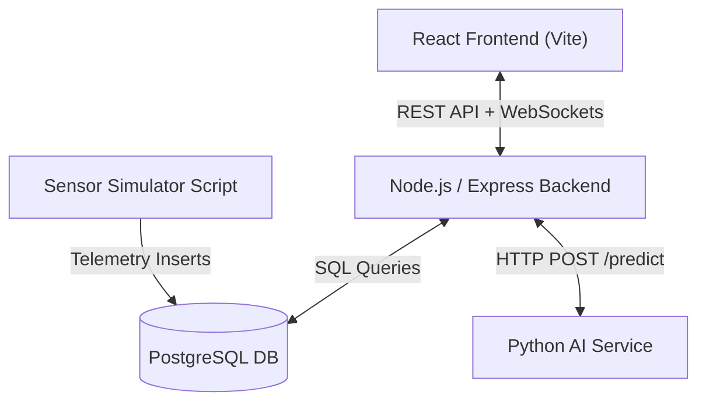
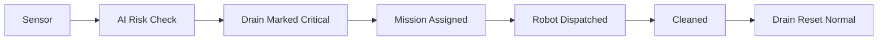

# 🚧 AI-DrainOS: Autonomous Municipal Drainage Monitoring & Robot Dispatch System

[](LICENSE)
[](https://nodejs.org)
[](https://www.postgresql.org)
[](https://www.python.org)
[](https://www.docker.com)

**AI-DrainOS** is an intelligent, full-stack municipal drainage management platform designed to monitor urban drainage networks in real time, predict flood risks using machine learning, automate autonomous cleaning robot dispatches, manage battery charging lifecycles, and enforce strict Role-Based Access Control (RBAC).

---

## Table of Contents

1. [Project Title](#1-project-title)
2. [Project Overview](#2-project-overview)
3. [Problem Statement](#3-problem-statement)
4. [Objectives](#4-objectives)
5. [Key Features](#5-key-features)
6. [System Architecture](#6-system-architecture)
7. [Frontend Architecture](#7-frontend-architecture)
8. [Backend Architecture](#8-backend-architecture)
9. [Python AI Service Architecture](#9-python-ai-service-architecture)
10. [PostgreSQL Database](#10-postgresql-database)
11. [Socket.IO Real-time Communication](#11-socketio-real-time-communication)
12. [Robot Mission Engine](#12-robot-mission-engine)
13. [Robot Charging System](#13-robot-charging-system)
14. [Sensor Simulator](#14-sensor-simulator)
15. [AI Flood Prediction](#15-ai-flood-prediction)
16. [Manual Mission Control](#16-manual-mission-control)
17. [Notification System](#17-notification-system)
18. [Settings Management](#18-settings-management)
19. [Authentication and RBAC](#19-authentication-and-rbac)
20. [API Endpoint List](#20-api-endpoint-list)
21. [Database Tables](#21-database-tables)
22. [Important Socket.IO Events](#22-important-socketio-events)
23. [Environment Variables](#23-environment-variables)
24. [Installation Instructions](#24-installation-instructions)
25. [Development Setup](#25-development-setup)
26. [How to Start PostgreSQL](#26-how-to-start-postgresql)
27. [How to Start Backend](#27-how-to-start-backend)
28. [How to Start Frontend](#28-how-to-start-frontend)
29. [How to Start Python AI Service](#29-how-to-start-python-ai-service)
30. [How to Start Sensor Simulator](#30-how-to-start-sensor-simulator)
31. [Testing Instructions](#31-testing-instructions)
32. [Project Folder Structure](#32-project-folder-structure)
33. [System Workflow](#33-system-workflow)
34. [Robot Lifecycle](#34-robot-lifecycle)
35. [Critical Drain Workflow](#35-critical-drain-workflow)
36. [Sensor → AI → Alert Workflow](#36-sensor--ai--alert-workflow)
37. [Mission → Robot → Cleaning → Charging Workflow](#37-mission--robot--cleaning--charging-workflow)
38. [Screenshots Section](#38-screenshots-section)
39. [Known Limitations](#39-known-limitations)
40. [Future Enhancements](#40-future-enhancements)

---

## 1. Project Title
**AI-DrainOS — Smart Municipal Drainage Monitoring & Autonomous Robot Dispatch Platform**

## 2. Project Overview
AI-DrainOS unifies IoT telemetry, machine learning flood predictions, GIS mapping, real-time WebSockets, and automated robotic cleaning into a single command center.

## 3. Problem Statement
Urban flash flooding caused by blocked storm drains poses significant risks to infrastructure and safety. Manual drain inspection is reactive, dangerous, and inefficient. AI-DrainOS solves this through real-time telemetry, predictive AI, and autonomous robot dispatches.

## 4. Objectives
- Provide real-time visibility into municipal drainage health.
- Automate flood risk predictions using machine learning.
- Dispatch autonomous robots to critical drains before flash floods occur.
- Manage robot battery lifecycles and automated charging.
- Deliver granular Role-Based Access Control (Admin / Operator).

## 5. Key Features
- **Real-Time GIS Drain Map**: Interactive Leaflet map with animated robot markers (`react-leaflet-drift-marker`).
- **Autonomous Robot Dispatch**: Automatic nearest-robot assignment for drains flagged Critical.
- **AI Risk Engine**: Python machine learning service evaluating water level, gas, and temperature telemetry.
- **Battery Management & Charging**: Autonomous routing to designated charging stations when battery drops below low threshold (20%).
- **User Management & RBAC**: Admin management of system users, role privileges, and account activation/deactivation.
- **Real-time Notifications**: Instant Socket.IO notifications for critical alerts, low battery warnings, and completed cleanings.
- **System Settings**: Configurable thresholds for water levels, battery limits, and simulation intervals.
- **PDF Report Generation**: Exportable system analytical reports.

## 6. System Architecture



Detailed architectural specifications are available in [docs/architecture.md](docs/architecture.md).

## 7. Frontend Architecture
Built with React 19, Vite 8, Vanilla CSS design tokens, React-Leaflet, Chart.js / Recharts, and Socket.IO client. Uses modular layout components (`DashboardLayout`, `Sidebar`, `Header`) and views (`UsersPage`, `SettingsPage`, `MissionControl`).

## 8. Backend Architecture
Node.js + Express backend featuring modular routes (`auth`, `drains`, `robots`, `missions`, `sensors`, `alerts`, `predictions`, `settings`), JWT authentication middleware, role enforcement (`adminOnly`), and a 5-second event loop driving real-time simulation logic.

## 9. Python AI Service Architecture
Flask application running on port 5001. Loads joblib-serialized ML model (`model.pkl`) to predict flood risk (`LOW`, `MEDIUM`, `HIGH`) based on water level, gas level, and temperature inputs.

## 10. PostgreSQL Database
Relational model database storing system accounts, session tokens, configurations, GIS drain locations, robot state, sensor telemetry, alerts, and mission logs. Detailed schema details available in [docs/database.md](docs/database.md).

## 11. Socket.IO Real-time Communication
Integrated WebSocket server pushing dynamic updates (`drainCleaned`, `criticalAlert`, `batteryLow`, `dashboardUpdate`) to connected client dashboards without requiring full-page reloads.

## 12. Robot Mission Engine
Service module (`services/missionEngine.js`) calculating nearest available idle robot using Euclidean distance formula and assigning active dispatch targets to blocked drains.

## 13. Robot Charging System
Automatic low battery detection (battery <= 20%). Re-routes active/idle robots to nearest charging hub (`charging_stations`), incrementally charges battery (+2% per loop), and resets status to `Idle` at 100%.

## 14. Sensor Simulator
Background utility (`scripts/simulateSensors.js`) inserting realistic sensor telemetry (water level, toxic gas level, temperature) to simulate real-world municipal sensor feeds.

## 15. AI Flood Prediction
Machine learning integration (`routes/predictions.js`) forwarding live sensor data to the Python AI service, with automatic fallback to local threshold rules if the AI endpoint is unreachable.

## 16. Manual Mission Control
UI interface (`pages/MissionControl.jsx`) enabling operators to manually select specific drains and dispatch available robots on demand.

## 17. Notification System
Toast alerts powered by `react-toastify` and `NotificationDropdown` triggered by backend Socket.IO events.

## 18. Settings Management
System parameters (`critical_threshold`, `warning_threshold`, `battery_low_threshold`, `sensor_sim_interval`) adjustable by Administrators via `SettingsPage.jsx`.

## 19. Authentication and RBAC
JWT bearer authentication with bcrypt password hashing.
- **Admin**: Full control (Manage users, settings, drains, robots, missions, view analytics/sensors).
- **Operator**: Operational view (View dashboard, map, sensors, manual robot dispatch, flag drain critical; read-only settings; restricted from user management).

## 20. API Endpoint List
Comprehensive list of REST endpoints documented in [docs/api.md](docs/api.md).

## 21. Database Tables
Database tables (`users`, `refresh_tokens`, `settings`, `drains`, `robots`, `sensors`, `alerts`, `missions`, `charging_stations`, `reports`) documented in [docs/database.md](docs/database.md).

## 22. Important Socket.IO Events
- `drainCleaned`: Fired when a robot reaches target drain and completes cleaning.
- `criticalAlert`: Fired when a **new** Critical alert is created.
- `batteryLow`: Fired when a robot battery drops <= 20% and is routed to a charging station.
- `dashboardUpdate`: Emitted every 5s with latest system stat counters.

## 23. Environment Variables
- `POSTGRES_HOST` (default: localhost)
- `POSTGRES_PORT` (default: 5432)
- `POSTGRES_DB` (default: ai_drainos)
- `POSTGRES_USER` (default: postgres)
- `POSTGRES_PASSWORD` (default: admin123)
- `PORT` (default: 5000)
- `JWT_SECRET` (default: supersecretkey)
- `AI_SERVICE_URL` (default: http://127.0.0.1:5001)
- `OPENWEATHER_API_KEY` (optional key for live weather data in `WeatherMonitor` / `WeatherForm`)
- `FRONTEND_URL` (default: http://localhost:5173, used in Socket.IO CORS)
- `VITE_API_URL` (default: http://localhost:5000/api)
- `VITE_SOCKET_URL` (default: http://localhost:5000)

## 24. Installation Instructions
1. Clone the repository.
2. Install root, server, and client dependencies:
   ```bash
   npm run install:all
   ```

## 25. Development Setup
Run database setup script:
```bash
cd server
npm run db:setup        # create tables + seed data
npm run db:setup:fresh  # drop + recreate + seed (restores pristine demo state)
```

## 26. How to Start PostgreSQL
Ensure local PostgreSQL service is active or run via Docker:
```bash
docker compose up postgres -d
```

## 27. How to Start Backend
```bash
cd server
npm run dev
```

## 28. How to Start Frontend
```bash
cd client
npm run dev
```

## 29. How to Start Python AI Service
```bash
cd ai
python app.py
```

## 30. How to Start Sensor Simulator
```bash
cd server
npm run simulate
```

## 31. Testing Instructions
Execute automated API test suite against safe test database:
```bash
cd server
npm test
```
The suite currently includes **37 tests** covering auth, RBAC, drains, robots, missions,
alerts, settings, analytics, and workflow integration.

## 32. Project Folder Structure
```
AI-DrainOS/
├── ai/                      # Python Flask AI prediction service
│   ├── app.py
│   ├── model.pkl
│   └── train_model.py
├── client/                  # React Vite Frontend Application
│   ├── src/
│   │   ├── components/
│   │   ├── pages/
│   │   ├── services/
│   │   └── App.jsx
│   └── vite.config.js
├── server/                  # Node.js Express Backend & Socket.IO
│   ├── config/
│   ├── controllers/
│   ├── middleware/
│   ├── routes/
│   ├── services/
│   ├── tests/
│   ├── app.js
│   └── index.js
├── database/                # SQL Schema and Seed data
│   ├── schema.sql
│   └── seed.sql
├── docs/                    # Architectural & API Documentation
│   ├── architecture.md
│   ├── api.md
│   ├── database.md
│   └── workflow.md
├── docker/                  # Multi-service Dockerfiles
├── docker-compose.yml
├── .env.example
└── README.md
```

## 33. System Workflow
Detailed step-by-step workflows documented in [docs/workflow.md](docs/workflow.md).

## 34. Robot Lifecycle
Idle → Active (Dispatched) → Movement to Target → Drain Cleaning → Completed → Charging (if battery <= 20%) → Fully Charged (100%) → Idle.

## 35. Critical Drain Workflow



## 36. Sensor → AI → Alert Workflow
Sensor Telemetry → Express API → Flask AI (`POST /predict`) → Alert Table → Socket.IO (`criticalAlert`) → Frontend Toast Notification.

## 37. Mission → Robot → Cleaning → Charging Workflow
Mission Assigned → Target GIS Set → Live Loop Movement → Destination Reached → Drain Normal → Battery Check → Station Routing → Fully Charged.

## 38. Screenshots Section
*(Add UI Screenshots here)*
- Dashboard Overview
- Real-time Drain GIS Map
- User Management Page
- System Settings

## 39. Known Limitations
- Simulated GIS step movement uses approximate linear increments rather than road-network pathfinding.
- Sensor simulator runs locally in synthetic mode.

## 40. Future Enhancements
- Integration with OpenStreetMap OSRM routing engine for real-world road navigation.
- Physical IoT sensor device hardware integration via MQTT protocol.
- Deep learning neural network models for predictive flood forecasting.
