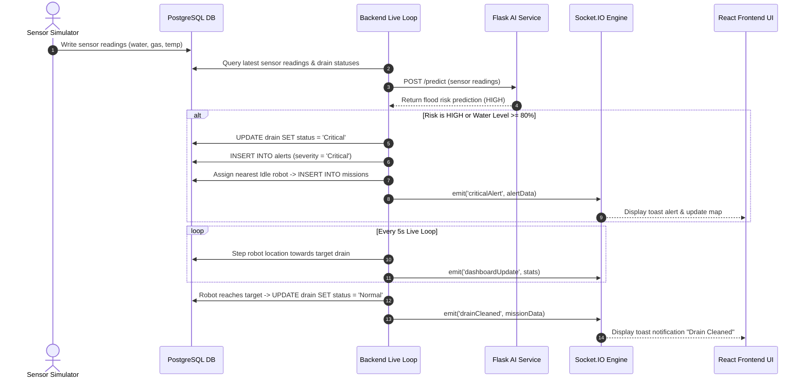

# AI-DrainOS Architecture Documentation

## Overview

**AI-DrainOS** is an autonomous municipal drainage monitoring and robot dispatch platform. It collects real-time sensor data across urban drainage networks, predicts flood risks using a Python machine learning service, generates automated alerts, dispatches cleaning robots to critical drains, and monitors battery charging lifecycles.

```mermaid
graph TD
    Client["React Frontend (Vite/Nginx)"]
    Server["Node.js / Express Backend (Port 5000)"]
    Database[("PostgreSQL Database (Port 5432)")]
    AIService["Python Flask AI Service (Port 5001)"]
    SensorSim["Sensor Simulator Script"]
    SocketIO["Socket.IO Real-time Engine"]

    Client <-->|REST API + WebSockets| Server
    Server <-->|SQL Queries (pg pool)| Database
    Server <-->|HTTP POST /predict| AIService
    SensorSim -->|Periodic Updates| Database
    Server <-->|Real-time Events| SocketIO
    SocketIO -->|Push Notifications| Client
```

---

## Tier Breakdown

### 1. Presentation Tier (React Frontend)
- **Framework**: React 19 + Vite 8
- **Styling**: Vanilla CSS with dark mode toggle & responsive design
- **Mapping**: Leaflet / React-Leaflet with custom animated robot markers (`react-leaflet-drift-marker`)
- **Real-Time Updates**: Socket.IO client listening for `drainCleaned`, `criticalAlert`, `batteryLow`, and `dashboardUpdate` events
- **State & Access Control**: JWT token authentication with role-based routing (Admin / Operator views)

### 2. Application Tier (Node.js/Express Backend)
- **Framework**: Express.js (v5)
- **Real-time Server**: Socket.IO integrated with HTTP server
- **Live System Loop**: 5-second interval loop executing:
  - Critical drain detection & automated robot mission assignment
  - Battery consumption logic for active robots
  - Low battery detection & routing to nearest charging station
  - Incremental robot movement simulation toward target coordinates
  - Mission completion & drain status reset to "Normal"
  - Dashboard stats calculation & real-time socket emission
- **Authentication**: JWT bearer authentication, bcrypt password hashing, refresh token rotation, and RBAC middleware

### 3. Intelligence Tier (Python AI Service)
- **Framework**: Flask (Port 5001)
- **Machine Learning Model**: Joblib-serialized Random Forest / Decision Tree trained on drainage sensor parameters
- **Inputs**: `water_level` (%), `gas_level` (ppm), `temperature` (°C)
- **Outputs**: Flood risk level (`LOW`, `MEDIUM`, `HIGH`)
- **Input Validation**: Returns `400` for non-object bodies, missing fields, or non-numeric values; out-of-range values are clamped before prediction.
- **Fallback Engine**: Backend defaults to rule-based threshold evaluation if AI service is unreachable

### 4. Persistence Tier (PostgreSQL Database)
- **Database Engine**: PostgreSQL 15+
- **Schema**: Relational model containing 10 core tables: `users`, `refresh_tokens`, `settings`, `drains`, `robots`, `sensors`, `alerts`, `missions`, `charging_stations`, `reports`
- **Data Protection**: Parameterized queries preventing SQL injection, cascading deletes on foreign keys

---

## Multi-Component Interaction Flow


