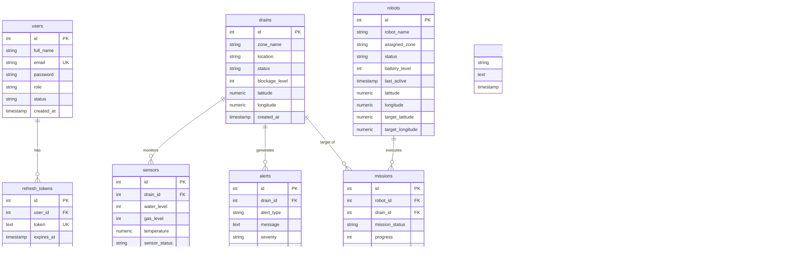

# AI-DrainOS Database Schema Documentation

Database System: PostgreSQL 15+  
Default Development Database: `ai_drainos`  
Test Database: `ai_drainos_test`

---

## Entity-Relationship Diagram (Mermaid)

---

## Core Tables & Descriptions

### 1. `users`
Stores system accounts with Role-Based Access Control (`Admin`, `Operator`) and status (`Active`, `Inactive`).
- `id` (SERIAL PRIMARY KEY)
- `full_name` (VARCHAR(100))
- `email` (VARCHAR(100) UNIQUE)
- `password` (VARCHAR(255) bcrypt hash)
- `role` (VARCHAR(20) DEFAULT 'Operator')
- `status` (VARCHAR(20) DEFAULT 'Active')
- `created_at` (TIMESTAMP)

### 2. `refresh_tokens`
Stores JWT refresh tokens for session rotation and logout revocation.

### 3. `settings`
Key-value store for global threshold configurations:
- `critical_threshold` (default: 80)
- `warning_threshold` (default: 50)
- `battery_low_threshold` (default: 20)
- `sensor_sim_interval` (default: 10)
- `notification_enabled` (default: true)

### 4. `drains`
Drainage location registry with GIS coordinates (Madurai, Tamil Nadu region defaults) and blockage statuses (`Normal`, `Warning`, `Critical`).

### 5. `robots`
Robot fleet tracking with dynamic GPS coordinates (`latitude`, `longitude`), target destination coordinates (`target_latitude`, `target_longitude`), battery level (0–100%), and operational statuses (`Idle`, `Active`, `Charging`).

### 6. `sensors`
Telemetry historical log linked to drains.

### 7. `alerts`
System alerts for blockages, critical water levels, and gas anomalies.

### 8. `missions`
Mission dispatch log linking assigned robots to target drains with progress tracking (0–100%).

### 9. `charging_stations`
Coordinates of designated charging hubs.

### 10. `reports`
Aggregated historical snapshot reports.
