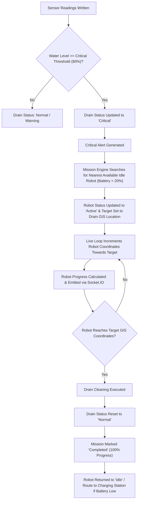
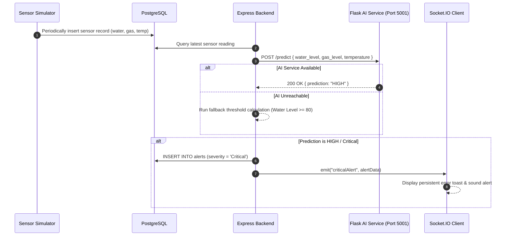

# AI-DrainOS System Workflow Documentation

This document illustrates key operational workflows within AI-DrainOS using Mermaid sequence and flow diagrams.

---

## 1. Critical Drain Lifecycle Workflow



---

## 2. Sensor → AI Prediction → Alert Workflow



---

## 3. Mission → Robot → Cleaning → Charging Workflow

```mermaid
sequenceDiagram
    autonumber
    actor Admin as Admin / Operator
    participant Server as Express Backend
    participant DB as PostgreSQL
    participant Loop as 5s Live Loop Engine
    participant Socket as Socket.IO

    Admin->>Server: POST /api/missions/dispatch { robot_id, drain_id }
    Server->>DB: INSERT INTO missions (status = 'Assigned')
    Server->>DB: UPDATE robots SET status = 'Active', target coordinates = drain coordinates
    loop Every 5 Seconds
        Loop->>DB: Decrement battery level (-1%)
        Loop->>DB: Move latitude & longitude step closer to target
        Loop->>Socket: emit("dashboardUpdate")
    end
    Loop->>DB: Robot reaches target coordinates
    Loop->>DB: UPDATE drains SET status = 'Normal'
    Loop->>DB: UPDATE missions SET mission_status = 'Completed', progress = 100
    Loop->>Socket: emit("drainCleaned", { robot, zone })
    alt Robot Battery <= 20%
        Loop->>DB: UPDATE robots SET status = 'Charging', target = Nearest Station
        Loop->>Socket: emit("batteryLow", robotData)
        loop Charging
            Loop->>DB: Increment battery level (+2%) until 100%
        end
        Loop->>DB: UPDATE robots SET status = 'Idle' when 100%
    end
```
